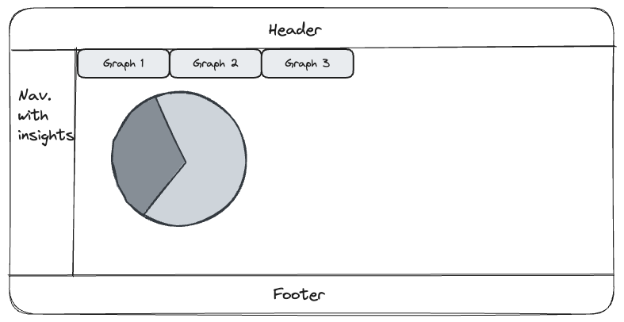

# About books-app

This app was created as an exercise.

It uses the following dataset: https://www.kaggle.com/datasets/sootersaalu/amazon-top-50-bestselling-books-2009-2019

It is a simple react application that renders the following layout:

## Insights

The left panel contains Insights. This showcase the relevant numbers from the dataset, like how many authors there are and same for titles, genre, and reviews.

## Header and Footer

Simple Header with title and footer with other info, like author.

## Main Content

This is where the graphs created are displayed, there are four of them:

- Authors, shows the top 20 authors, those authors which has authored most books in the dataset.
- Genre, shows which are the existent genres in the dataset.
- Titles, shows the top 20 titles, those titles that has more editions in the dataset.
- Reviews, shows the top 20 titles with higher number of reviews in the dataset.

# Technical Details

This project was bootstrapped with [Create React App](https://github.com/facebook/create-react-app).

For creating the UI components and layout the project uses [Material UI](https://mui.com/material-ui/).

For the charts used in this apps the project uses [Victory] (https://commerce.nearform.com/open-source/victory).

For some useful functions that help spped up the development the project uses [ramda] (https://ramdajs.com/).

## Development

### `npm start`

Runs the app in the development mode.\
Open [http://localhost:3000](http://localhost:3000) to view it in your browser.

### `npm test`

Launches the test runner in the interactive watch mode.\

### `npm run build`

Builds the app for production to the `build` folder.\
It correctly bundles React in production mode and optimizes the build for the best performance.
